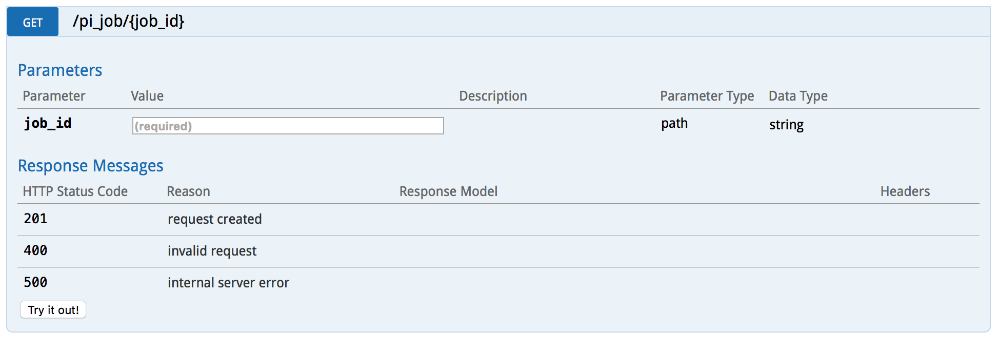

## IAAS solution for PI 
Code to containerize a flask app that generates the value of PI upto a given number of digits. 

## DOCKER

Docker has been used to provide containerization and infrastructure-as-a-code service.

Docker compose file is provided to execute the flask app in a container. It is configured to expose the API port from the container to that of the hostip/localhost - 5000.

Installation steps:
a. Clone this repo by running:

       ```bash
       git clone --recursive https://github.com/plokhande/pi_iaas
       ```

b. Install Docker on the host system as described in [Installing Docker] (https://docs.docker.com/install/).
c. Execute the below command to setup the flask-app container using docker-compose

```bash
docker-compose up 
```
  - Access the application on (hostip:5000/)

## FLASK

Flask is used for the API code. Complete code resides in pi_flaskapp.py under the pi_app folder. 

Consists of mainly three methods for API endpoints

- **[POST /pi_job]
This takes one argument, the number of digits upto which the value of PI has to be calculated. It returns a uniquely generated job_id, which can be used for further references to fetch the status of the job.

- **[GET /pi_job/{job_id}]
This method takes the job_id generated by the post method as input and returns 
   - if the job is 'in-progrss' : the status of the post method alongwith the elapsed time is returned
   - otherwise returns only the status of the job.

- **[GET /download_pi_job/{job_id}]
This method takes the job_id generated by the post method as input and downloads a text file to the system containing the results of the corresponding PI value.

## FLASK RESTPLUS

Flask restplus which is an adaption of swagger is used for providing documentation for this application. This gives the ease of documentation with added benefit of testing the API.

Complete documentation for the API usage can be found at (hostip:5000/) - where the flask app is running. This page also provides with options to test the API with the click of a button. Example screenshots can be found below

**[API home screen]


**[POST /pi_job]


**[GET /pi_job/{job_id}]



**[GET /download_pi_job/{job_id}]

